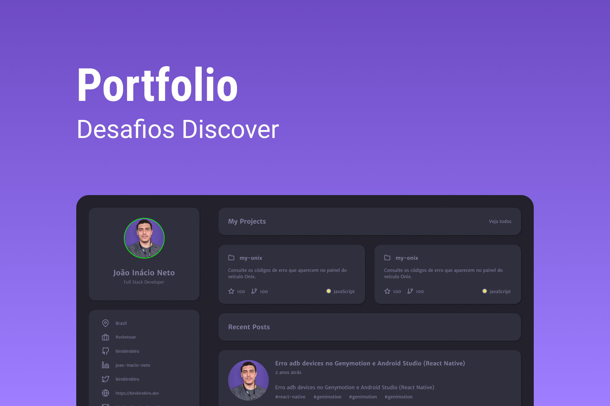

<!-- markdownlint-disable MD033 -->

# Desafios Discover - Rocketseat

Todos os desafios listados foram idealizados pela Rocketseat Education. Os projetos foram desenvolvidos por mim através dos modelos preconcebidos.

Para conhecer os desafios, acesse <https://app.rocketseat.com.br/discover/challenges>. É necessário ter uma conta na [Rocketseat](https://www.rocketseat.com.br/) para acessá-los.

   
  <table>
    <thead>
      <tr>
        <th align="center">
          
          

            <code>#</code>
          

        </th>
        <th align="center">
          
          

            <small>
              <code>projeto</code>
            </small>
          

        </th>
        <th align="center">
          
          

            <small>
              <code>preview</code>
            </small>
          

        </th>
        <th align="center">
            
            

                <small>
                <code>deploy</code>
                </small>
            

        </th>
      </tr>
    </thead>
    <tbody>
        <tr>
          <td><code>01</code></td>
          <td><a href="" target="_blank" ><code>portifolio</code></a></td>
          <td align="center">
          </td>
          <td align="center"></td>
        </tr>
    </tbody>
  </table>

